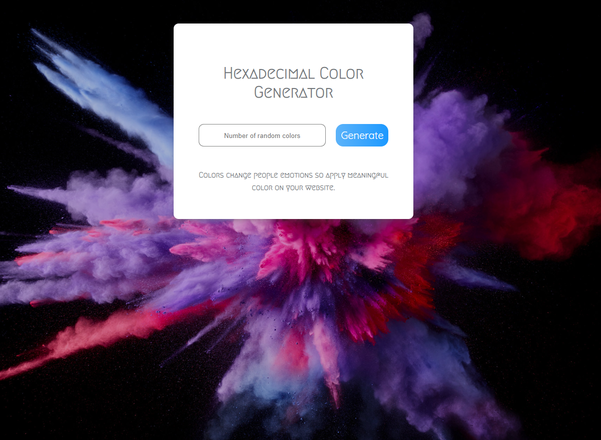

# Interactive Hex-color Generator App

This app is developed as part of my 6 months coding bootcamp at Integrify Helsinki. It is about implementing a random hex-color generator using javaScript fundamentals and DOM manipulation techniques. All functionalities was completed with ONLY Vanilla JavaScript. Happy Coding 😀.

## Demo

You can see the live demo of the App here:

[(https://sulaymon333.github.io/hex-color-generator/)](https://sulaymon333.github.io/hex-color-generator/)

# 

## Author

Sulaymon Tajudeen. [Learn More](https://sulaymontajudeen.com/)

## Technologies

- HTML
- CSS
- javaScript (Vanilla)

## License

This project is licensed under the MIT License - see the [LICENSE.md](./LICENSE.md) file for details.
